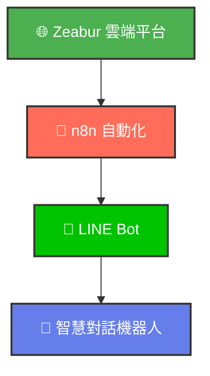

<div align="center">


<br>
<br>

# 🤖 Zeabur + n8n + LINE Bot 完整教學

### ✨ 從零開始打造你的智慧對話機器人 ✨

<br>

[](https://github.com/ChatGPT3a01/zeabur-n8n-linebot-guide)
[](https://zeabur.com/referral?referralCode=3a01chatgpt)
[](https://n8n.io)
[](https://developers.line.biz)
[](https://react.dev)

<br>

### 📖 完整教學 | 🎯 實戰模板 | 🎓 零基礎友善

<br>
<br>

## 🎓 開始學習

### 📺 線上觀看互動式教學簡報

<br>

<a href="https://chatgpt3a01.github.io/zeabur-n8n-linebot-guide/">
  
</a>

<br>
<br>

**本專案包含完整的互動式教學簡報**

📊 **5 個章節** | 📄 **超過 60 頁投影片** | ⏱️ **10 分鐘完成部署**

<br>

> ⚠️ **GitHub Pages 設定提醒**
> 如果簡報網址顯示 404 錯誤，請先到儲存庫的 `Settings` → `Pages` → `Source` 選擇 `GitHub Actions`

</div>

<br>
<br>

---

<br>

## 📖 專案簡介

<br>

<table>
<tr>
<td width="60%">

### 🎯 你將學會什麼？

這是一個**完整的實戰教學專案**，手把手帶你：

✅ **零成本部署** - 在 Zeabur 免費部署 n8n 平台
✅ **快速上手** - 10 分鐘完成完整設定
✅ **實戰導向** - 3 個真實工作流模板
✅ **視覺化操作** - 不需寫程式也能打造 Bot
✅ **永久免費** - 每月 $5 免費額度足夠使用

<br>

### 🌟 適合誰學習？

- 🎓 想學習自動化工作流的初學者
- 💼 想提升工作效率的上班族
- 🤖 想打造 LINE Bot 的開發者
- 📚 對 n8n 和 AI 整合有興趣的人

</td>
<td width="40%">

<div align="center">

### 🚀 核心技術

<br>



<br>

**一站式解決方案**

部署 → 設定 → 測試 → 上線

</div>

</td>
</tr>
</table>

<br>
<br>

---

<br>

## 📚 課程大綱

<br>

<table>
<tr>
<td width="50%">

### 📌 Part 1: Zeabur 平台註冊

<br>

```
🎯 學習目標
├── ✅ 註冊 Zeabur 帳號（使用推薦碼 3a01chatgpt）
├── ✅ 綁定手機號碼取得免費額度
├── ✅ 熟悉控制台操作介面
└── ✅ 了解免費方案額度與限制

⏱️ 預計時間：5 分鐘
📄 簡報頁數：8 頁
```

<br>

### 📌 Part 2: 一鍵部署 n8n

<br>

```
🎯 學習目標
├── ✅ 在 Zeabur 建立新專案
├── ✅ 選擇 n8n 模板快速部署
├── ✅ 自動配置 PostgreSQL 資料庫
├── ✅ 設定 n8n 管理員帳號
└── ✅ 取得專屬的 n8n 網址

⏱️ 預計時間：5 分鐘
📄 簡報頁數：10 頁
```

<br>

### 📌 Part 3: LINE Bot 設定

<br>

```
🎯 學習目標
├── ✅ 在 LINE Developers Console 建立 Channel
├── ✅ 取得 Channel Access Token
├── ✅ 取得 Channel Secret
└── ✅ 在 n8n 中建立 LINE 憑證

⏱️ 預計時間：10 分鐘
📄 簡報頁數：12 頁
```

</td>
<td width="50%">

### 📌 Part 4: 串接與測試

<br>

```
🎯 學習目標
├── ✅ 理解 Webhook 運作原理
├── ✅ 取得 n8n Webhook URL
├── ✅ 在 LINE 設定 Webhook URL
├── ✅ 建立簡單的自動回覆工作流
└── ✅ 測試訊息收發功能與除錯

⏱️ 預計時間：10 分鐘
📄 簡報頁數：15 頁
```

<br>

### 📌 Part 5: 實戰應用

<br>

```
🎯 學習目標
├── 🌤️ 模板 1：LINE 天氣查詢機器人
│   ├── 智慧辨識城市名稱
│   ├── 串接 OpenWeatherMap API
│   └── 即時回覆天氣資訊
│
├── 📰 模板 2：RSS 爬蟲工作流
│   ├── 自動訂閱 RSS 摘要
│   ├── 定時抓取最新文章
│   └── 推播到 LINE 通知
│
└── 📊 模板 3：每日摘要工作流
    ├── 整合多個資料來源
    ├── 每日定時產生摘要
    └── 自動推播到指定對象

⏱️ 預計時間：30 分鐘
📄 簡報頁數：32 頁
```

</td>
</tr>
</table>

<br>
<br>

---

<br>

## 📥 n8n 工作流模板下載

<br>

<div align="center">

### 🎁 3 個實用模板，立即下載使用！

<br>

</div>

<table>
<tr>
<td align="center" width="33%">

<br>

### 🌤️ 天氣查詢機器人

<br>


<br>
<br>

**功能說明**

透過 LINE 查詢台灣各縣市即時天氣

✅ 城市辨識
✅ 天氣 API 串接
✅ 自動回覆

<br>

<a href="https://raw.githubusercontent.com/ChatGPT3a01/zeabur-n8n-linebot-guide/master/download/n8n_問Line天氣模板.json" download>
  
</a>

</td>
<td align="center" width="33%">

<br>

### 📰 RSS 爬蟲工作流

<br>


<br>
<br>

**功能說明**

自動抓取網站 RSS 更新

✅ RSS 訂閱
✅ 資料過濾
✅ 定時執行

<br>

<a href="https://raw.githubusercontent.com/ChatGPT3a01/zeabur-n8n-linebot-guide/master/download/n8n_RSS爬蟲工作流.json" download>
  
</a>

</td>
<td align="center" width="33%">

<br>

### 📊 每日摘要工作流

<br>


<br>
<br>

**功能說明**

自動產生每日資訊摘要並推送

✅ 多來源整合
✅ 內容彙整
✅ 定時推播

<br>

<a href="https://raw.githubusercontent.com/ChatGPT3a01/zeabur-n8n-linebot-guide/master/download/n8n_完整每日摘要工作流.json" download>
  
</a>

</td>
</tr>
</table>

<br>

<details>
<summary><b>💡 點擊查看：如何使用模板？</b></summary>

<br>

### 📋 匯入步驟

1. **下載 JSON 檔案**
   - 點擊上方下載按鈕
   - 儲存 `.json` 檔案到電腦

2. **匯入到 n8n**
   - 登入你的 n8n 管理介面
   - 點擊右上角 `⋮` → `Import from File`
   - 選擇下載的 JSON 檔案
   - 點擊 `Import` 完成匯入

3. **設定憑證**
   - 根據工作流需求設定相應的憑證
   - 例如：LINE Messaging API、天氣 API 等

4. **測試執行**
   - 點擊 `Execute Workflow` 測試
   - 確認運作正常後啟用（Active）

<br>

> 💡 **提示**：這些模板是課程的延伸實作範例，建議完成 Part 1-4 後再使用！

</details>

<br>
<br>

---

<br>

## 💡 為什麼選擇 Zeabur + n8n？

<br>

<table>
<tr>
<td width="33%">

### 🆓 Zeabur

**最適合學習的免費雲端平台**

<br>

✅ 每月 **$5 免費額度**
✅ **不需信用卡**即可開始
✅ **一鍵部署** n8n 模板
✅ 自動配置 **HTTPS**
✅ 內建 **PostgreSQL**
✅ **極速部署**，5 分鐘完成

<br>

**為什麼不選其他平台？**

❌ Heroku: 已取消免費方案
❌ AWS/GCP: 設定複雜
❌ 傳統 VPS: 需維護伺服器
✅ **Zeabur: 簡單、免費、快速！**

</td>
<td width="33%">

### 🔄 n8n

**最強大的視覺化自動化平台**

<br>

✅ **拖拉式操作** - 不需寫程式
✅ **400+ 整合** - 連接各種服務
✅ **AI 原生支援** - ChatGPT、Claude
✅ **視覺化除錯** - 即時查看資料流
✅ **開源免費** - 資料完全掌控
✅ **高效能** - 每秒 220 個工作流

<br>

**n8n 2.0 新功能**

🔐 更安全的執行環境
🚀 更快的執行速度
🤖 增強的 AI Agent 支援
📈 更好的錯誤處理

</td>
<td width="33%">

### 💬 LINE Bot

**台灣市佔率第一的聊天平台**

<br>

✅ 台灣用戶超過 **2100 萬**
✅ 使用者最熟悉的介面
✅ **完整的 API 文件**
✅ **免費方案充足**（500 則/月）
✅ 豐富的訊息格式
✅ 主動推播功能

<br>

**為什麼選擇 LINE？**

在台灣，LINE 是：
- 📱 最多人使用的通訊軟體
- 💼 企業溝通的首選平台
- 🤝 最容易觸及用戶的管道

</td>
</tr>
</table>

<br>
<br>

---

<br>

## ✨ 教學簡報特色

<br>

<div align="center">

<table>
<tr>
<td align="center" width="25%">

### 🎨

**精美互動介面**

卡片式設計
步驟清晰

</td>
<td align="center" width="25%">

### 📱

**響應式佈局**

手機電腦
都能學習

</td>
<td align="center" width="25%">

### 🖼️

**圖文並茂**

每個步驟
詳細說明

</td>
<td align="center" width="25%">

### ⚡

**流暢動畫**

提升學習
體驗

</td>
</tr>
</table>

</div>

<br>
<br>

---

<br>

## 🎓 學習資源

<br>

<table>
<tr>
<td width="50%">

### 📖 官方文件

<br>

- **[Zeabur 文件](https://zeabur.com/docs)** - 平台使用指南
- **[n8n 官方文件](https://docs.n8n.io/)** - 工作流設計完整教學
- **[LINE Messaging API](https://developers.line.biz/en/docs/messaging-api/)** - LINE Bot 開發文件

<br>

</td>
<td width="50%">

### 🔗 延伸閱讀

<br>

- [n8n 2026 深度指南](https://hatchworks.com/blog/ai-agents/n8n-guide/) - n8n 最新功能與 AI 整合
- [Zeabur 免費方案說明](https://zeabur.com/pricing) - 了解免費額度與限制
- [LINE Bot Webhook 設定](https://developers.line.biz/en/docs/messaging-api/receiving-messages/) - 進階 LINE Bot 開發

<br>

</td>
</tr>
</table>

<br>
<br>

---

<br>

## 👨‍🏫 關於作者

<br>

<div align="center">

### 曾慶良 主任（阿亮老師）

<br>


<br>
<br>

<table>
<tr>
<td width="50%" valign="top">

#### 📌 現任職務

<br>

🎓 **新興科技推廣中心主任**
🎓 **教育部學科中心所長教師**
🎓 **臺北市語文學習領域輔導員**

</td>
<td width="50%" valign="top">

#### 🏆 獲獎紀錄

<br>

🥇 **2025年** STEAM臺北市專業教學講師認證
🥇 **2024年** 教育部人工智慧講師認證
🥇 **2022、2023年** 指導學生XR專題競賽特優
🥇 **2022年** VR教材開發教師組特優
🥇 **2019年** 百大資訊人才獎
🥇 **2018、2019年** 天下創新100教師
🥇 **2018年** 臺北市特殊優良教師
🥇 **2017年** 教育部行動學習優等

</td>
</tr>
</table>

<br>

### 📞 聯絡方式

<br>

[](https://www.youtube.com/@Liang-yt02)
[](https://www.facebook.com/groups/2754139931432955)
[](mailto:3a01chatgpt@gmail.com)

</div>

<br>
<br>

---

<br>

## 🙏 致謝

<br>

<div align="center">

感謝以下開源專案與平台的支持

<br>

[](https://n8n.io)
[](https://zeabur.com/referral?referralCode=3a01chatgpt)
[](https://developers.line.biz)

[](https://react.dev)
[](https://tailwindcss.com)
[](https://www.radix-ui.com)

</div>

<br>
<br>

---

<br>

## 📜 授權聲明

<br>

<div align="center">

**© 2026 阿亮老師 版權所有**

<br>

本專案僅供「**阿亮老師課程學員**」學習使用

<br>

### ⚠️ 禁止事項

<br>

| ❌ 禁止修改本專案內容 | ❌ 禁止轉傳或散布 |
|:---:|:---:|
| **❌ 禁止商業使用** | **❌ 禁止未經授權之任何形式使用** |

<br>

如有任何授權需求，請聯繫作者

</div>

<br>
<br>

---

<br>

<div align="center">

## 🌟 喜歡這個專案嗎？

<br>

如果這個教學對您有幫助，請給我們一個 ⭐ **Star**！

<br>

[](https://github.com/ChatGPT3a01/zeabur-n8n-linebot-guide)

<br>
<br>

**Made with ❤️ by 阿亮老師**

<br>

[⬆️ 回到頂部](#-zeabur--n8n--line-bot-完整教學)

<br>

---

<br>

© 2026 阿亮老師 版權所有

<br>

</div>
